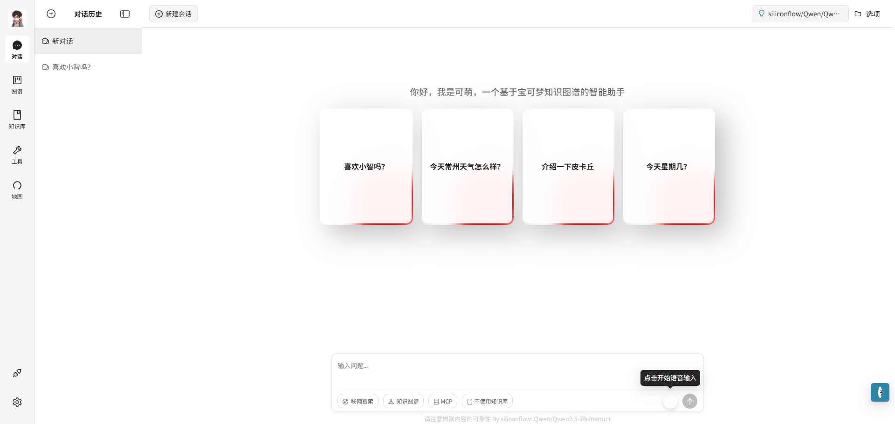

📘 English | [中文](./README.zh-CN.md)

# 


# 「Kemeng」  Domain Chat Assistant Based on Knowledge Graph and Corpus




---

## 📝 Project Introduction

Pokémon is one of the most influential IPs worldwide, with a massive universe and character data. Its long-term accumulation across games, animations, cards, and films has resulted in a highly structured knowledge system, making it ideal for knowledge graph modeling and intelligent Q&A scenarios.

With the advancement of LLMs and knowledge-enhanced techniques, building a **multimodal, structured, and interactive AI system** based on the Pokémon universe is now feasible. This project builds a Pokémon knowledge graph using data from Baidu Tieba and Wikipedia, covering characters, attributes, skills, regions, evolution paths, and more. Combined with LLM capabilities, we created a **Pokémon-domain smart assistant** — “Kemeng.”

By integrating **LangGraph pipeline orchestration**, **GraphRAG enhanced retrieval**, and **graph visualization**, users can both get accurate answers through natural language queries and visually explore the Pokémon world. The system also supports geographic mapping, linking Pokémon world locations to real-world coordinates for **spatial visualization**.

This project is designed to be a **transferable, scalable domain assistant template**, making it easy to adapt for other characters or fields (e.g., Su Shi, finance, e-government) by simply changing the knowledge source and graph structure.

---

## 🎯 System Architecture

The project includes a complete Vue3 + FastAPI stack and a functional Pokémon knowledge graph-based Q&A system. It combines semantic modeling (BERT + TF-IDF + rule matching) with generative Q&A, supporting questions about evolution, attribute restraints, skills, and geographic distribution.

In the future, we will optimize for multi-turn dialogs, complex graph reasoning, and navigation scenarios. We also plan to expand use cases like: graph-based reasoning, Pokédex auto-completion, and strategy suggestions.

Architecture overview:


---

## 🎯 Highlights

1. Fine-tuned a Pokémon-domain LLM ("Kemeng") using web-scraped data.
2. Built a Pokémon knowledge graph based on Wikipedia and forums.
3. Automated NER training with RoBERTa + TF-IDF + rule-based matching.
4. Integrated Whisper for ASR (speech-to-text) capabilities.
5. Provided an MCP service to retrieve Pokémon-world locations and display real-world coordinates via Leaflet.
6. Extracted documents with DeepDoc to enhance knowledge base parsing.
7. Used LangGraph to combine GraphRAG + Web Searcher + Vector DB.
8. Encapsulated agent base class for multi-agent workflows.
9. Supports graph search, web search, knowledge base search, MCP queries, and voice input, in any combination.

---


## 🚀 Quick Start

> **Requirements**: Docker & Docker Compose, Node.js ≥ 18, Python ≥ 3.11

### 1. Place the required data under [resources]( https://pan.baidu.com/s/1o48ankI6l9jaky5MeRqgYw?pwd=rkdy)

### 2. Clone the repo and configure environment variables

```bash
git clone https://github.com/jhlucc/pokemon-chat.git
cd Smart-Assistant
cp src/.env.template src/.env
cp Smart-Assistant/config/settings_example.py config/settings.py  # fill in API-KEYs as needed
```

### 3. Install Python dependencies

```bash
pip install -r requirements.txt
```

### 4. Start core services

```bash
cd docker
docker compose up -d  # Neo4j · Milvus · Whisper · MySQL
```

### 5. Import data into the graph and MySQL

```bash
cd scripts
python import_graph.py          # populate Neo4j
python import_pokemon_map.py    # populate MySQL
```

### 6. Launch backend services

```bash
cd server
python main.py                  # FastAPI + LangGraph

cd ../src/mcp
python mcp_server.py            # SSE example
```

### 7. Launch frontend

```bash
cd web
npm install
npm run dev
# visit http://localhost:3100/
```

---

## 🔭 Reference Projects

- https://github.com/xerrors/Yuxi-Know  
- https://github.com/BinNong/meet-libai  

---

## 📄 License

This project is licensed under the **MIT License**, free for commercial and personal use. Please retain author credits when redistributing.
