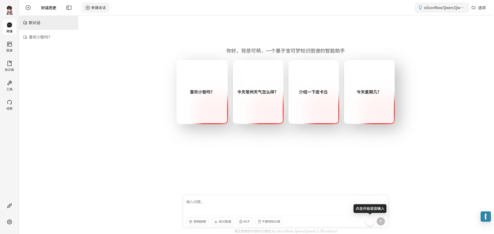

                          
<div align="right">
  <details>
    <summary >🌐 Language</summary>
    <div>  
      <div align="center">
        <a href="https://openaitx.github.io/view.html?user=jhlucc&project=pokemon-chat&lang=en">English</a>
        | <a href="https://openaitx.github.io/view.html?user=jhlucc&project=pokemon-chat&lang=zh-CN">简体中文</a>
        | <a href="https://openaitx.github.io/view.html?user=jhlucc&project=pokemon-chat&lang=zh-TW">繁體中文</a>
        | <a href="https://openaitx.github.io/view.html?user=jhlucc&project=pokemon-chat&lang=ja">日本語</a>
        | <a href="https://openaitx.github.io/view.html?user=jhlucc&project=pokemon-chat&lang=ko">한국어</a>
        | <a href="https://openaitx.github.io/view.html?user=jhlucc&project=pokemon-chat&lang=hi">हिन्दी</a>
        | <a href="https://openaitx.github.io/view.html?user=jhlucc&project=pokemon-chat&lang=th">ไทย</a>
        | <a href="https://openaitx.github.io/view.html?user=jhlucc&project=pokemon-chat&lang=fr">Français</a>
        | <a href="https://openaitx.github.io/view.html?user=jhlucc&project=pokemon-chat&lang=de">Deutsch</a>
        | <a href="https://openaitx.github.io/view.html?user=jhlucc&project=pokemon-chat&lang=es">Español</a>
        | <a href="https://openaitx.github.io/view.html?user=jhlucc&project=pokemon-chat&lang=it">Italiano</a>
        | <a href="https://openaitx.github.io/view.html?user=jhlucc&project=pokemon-chat&lang=ru">Русский</a>
        | <a href="https://openaitx.github.io/view.html?user=jhlucc&project=pokemon-chat&lang=pt">Português</a>
        | <a href="https://openaitx.github.io/view.html?user=jhlucc&project=pokemon-chat&lang=nl">Nederlands</a>
        | <a href="https://openaitx.github.io/view.html?user=jhlucc&project=pokemon-chat&lang=pl">Polski</a>
        | <a href="https://openaitx.github.io/view.html?user=jhlucc&project=pokemon-chat&lang=ar">العربية</a>
        | <a href="https://openaitx.github.io/view.html?user=jhlucc&project=pokemon-chat&lang=fa">فارسی</a>
        | <a href="https://openaitx.github.io/view.html?user=jhlucc&project=pokemon-chat&lang=tr">Türkçe</a>
        | <a href="https://openaitx.github.io/view.html?user=jhlucc&project=pokemon-chat&lang=vi">Tiếng Việt</a>
        | <a href="https://openaitx.github.io/view.html?user=jhlucc&project=pokemon-chat&lang=id">Bahasa Indonesia</a>
      </div>
    </div>
   </details> 

</div> 

📘 中文 | [English](./README.en.md)


# 「可萌」  基于知识库与知识图谱的专域聊天助手


 




---

## 📝 项目介绍

宝可梦（Pokémon）作为全球最具影响力的 IP 之一，拥有庞大的世界观设定与海量角色数据。在游戏、动画、卡牌、电影等多领域的多年积累下，其知识体系庞杂且高度结构化，非常适合应用于知识图谱建模与智能问答场景。

随着大语言模型（LLM）与知识增强技术的发展，将宝可梦宇宙构建为一个**多模态、结构化、可交互的 AI 系统**成为可能。本项目以 百度贴吧 与维基百科等数据源为基础，构建出覆盖宝可梦角色、属性、技能、地区、演化路径等元素的知识图谱，并结合大模型能力，打造一个**专属宝可梦世界的智能对话助手** ——「可萌」。

在此基础上，我们融合了 **LangGraph 推理流程编排**、 **GraphRAG 检索增强技术**，以及**知识图谱可视化探索能力**，使用户不仅可以通过自然语言提问获得精确答案，还能以图谱形式直观探索宝可梦世界。同时支持基于地理位置的地图定位功能，将宝可梦世界与真实世界坐标一一映射，实现 **宝可梦地点知识的空间可视化** :earth_asia: 。

​        本项目致力于打造一个可迁移、可扩展、面向爱好者的**专域智能助手模板系统**，你可以轻松将其迁移至其他角色中打造专域的智能助手，仅需更换知识源与图谱结构，即可实现高质量的语义问答与可视化知识探索体验。

---

## 🚀 新增特性 (New Features)

- **LangChain & LangGraph**: 重构为LangChain 1.x 与 LangGraph 1.0 多智能体编排对话助手
- **LightRAG Integration**: 支持 LightRAG 高效检索图谱构建
- **Advanced RAG**: 集成 Self-RAG、CRAG、HyDE 与 Query Decomposition 高级rag
- **Agentic Memory**: 具备用户偏好自适应的长时记忆能力与时间规划
- **MCP Service**: 支持 Model Context Protocol 连接真实世界地理数据
- **Performance**: 内置 Semantic Cache 与 Speculative RAG 加速生成

---

## 🎯系统架构

通过本项目的实施，我们不仅完成了vue3+fastapi的一个完整项目，同时构建了一个基于宝可梦知识图谱的智能问答系统。积累了语义结构建模如bert+tf-idf+规则匹配机制、以及图谱融合与生成式问答的丰富实践经验。系统支持对宝可梦的进化关系、属性克制、技能特征、地理分布等内容进行精准问答，极大提升了用户在交互式探索中的体验感。

架构核心：
- **混合检索**: 向量检索 (Milvus) + 图谱检索 (Neo4j) + 关键词检索 (BM25)
- **智能体编排**: LangGraph1.x 状态机管理复杂任务流
- **知识增强**: GraphRAG 提取实体关系

以下是本项目的核心技术架构图：

 

##  🎯项目特色

1. 基于爬取的数据微调了基于宝可梦的专域大模型——[可萌](https://huggingface.co/qwqqwq/qwen2.5-14b-instruct-pokemon-int4) 。
2. 基于爬取数据构建了宝可梦知识图谱（维基百科）。
3. 自动化标注训练NER数据，使用roberta+TF-IDF+规则匹配来命中图谱中的实体与属性。
4. 使用FunASR来实现ASR功能（阿里达摩院开源语音识别）。
5. 实现 MCP 服务，支持宝可梦世界与真实世界地理坐标的映射查询。
6. 抽取RAGflow中的deepdoc来强化知识库的解析和抽取能力。
7. 使用LangGraph实现多智能体协同（RAG + Search + Graph + MCP）。
8. 封装agent 基类实现多智能体功能。
9. 支持知识图谱搜索、网络搜索、知识库搜索、MCP搜索、语音搜索，可以同时集成也可以任选其一。

---

## 🛠️ 部署指南 (Deployment)

> **前置要求**：已安装 Docker / Docker Compose

### 🐳 Docker Compose 一键启动（推荐）

无需手动配置复杂环境，直接使用 Docker Compose 启动所有服务：

```bash
# 1. 克隆仓库
git clone https://github.com/skygazer42/pokemon-chat.git
cd pokemon-chat

# 2. 配置环境变量（Docker Compose 从 ./docker/.env 读取）
cp docker/.env.example docker/.env
# 编辑 docker/.env，填写 LLM API KEY（如 llm_api_key / SILICONFLOW_API_KEY）
# 可选：开启语音识别（FunASR）-> enable_asr=true，funasr_url=ws://funasr:10095（Docker）
# 可选：限制 CORS 来源（生产环境建议）-> cors_allow_origins=http://localhost:3100

# 3. 启动所有服务 (API + Web + 数据库 + MCP)
cd docker
docker compose --profile infra --profile mcp up -d --build
```

访问：
- **Web UI**: http://localhost:3100/
- **API 文档**: http://localhost:3100/api/docs（或直连 http://localhost:5050/docs）

### 📦 数据初始化（首次运行）

服务启动后，需要导入知识库与图谱数据。请将数据文件放入 `resources` 目录（[下载链接](https://pan.baidu.com/s/1o48ankI6l9jaky5MeRqgYw?pwd=rkdy)）。

然后执行导入脚本：

```bash
# 进入 API 容器
cd docker
docker compose exec api bash

# 导入 Neo4j 图谱数据
python scripts/import_graph.py

# 导入 MySQL 地图数据
python scripts/import_pokemon_map.py
```

### 💻 本地开发模式

如果你希望在本地运行前后端代码进行开发：

1. **启动基础依赖 (Infrastructure)**
   ```bash
   cd docker
   docker compose --profile infra up -d # 启动 Neo4j, Milvus, MySQL, FunASR
   ```

2. **启动后端 (Server)**
   ```bash
   cd server
   pip install -r requirements.txt
   python main.py
   ```

3. **启动前端 (Web)**
   ```bash
   cd web
   npm install
   npm run dev
   ```

> 提示：如果你只想体验/开发前端 UI（不启动后端），可以进入「设置」把“离线演示模式”切到“强制 Mock”。
> 这样前端会用本地 Mock 数据模拟后端接口，不依赖后端的 `base.yaml` 也能完整展示各页面与功能入口。

---

## 🔭 参考项目

- https://github.com/xerrors/Yuxi-Know
- https://github.com/BinNong/meet-libai

  

---

## 📄 License

本项目遵循 **MIT License**，可自由用于商业或个人项目。二次开发请保留原作者与来源信息。
