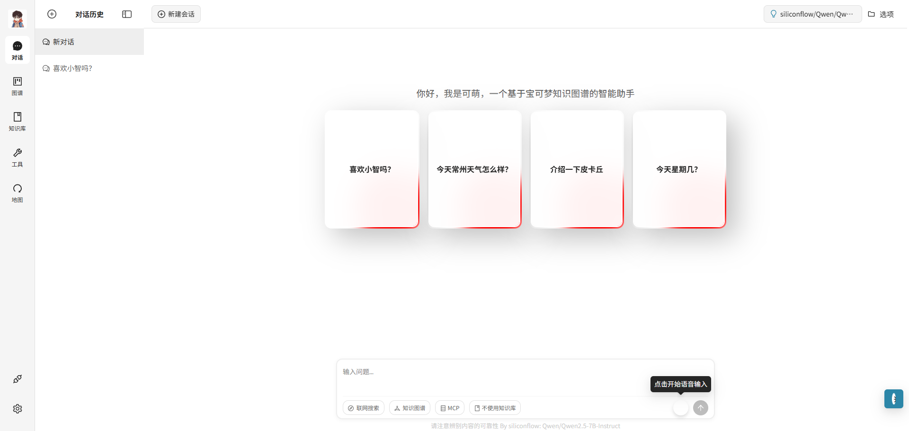

# 「可萌」  基于知识库与知识图谱的专域聊天助手





---

## 📝 项目介绍

宝可梦（Pokémon）作为全球最具影响力的 IP 之一，拥有庞大的世界观设定与海量角色数据。在游戏、动画、卡牌、电影等多领域的多年积累下，其知识体系庞杂且高度结构化，非常适合应用于知识图谱建模与智能问答场景。

随着大语言模型（LLM）与知识增强技术的发展，将宝可梦宇宙构建为一个**多模态、结构化、可交互的 AI 系统**成为可能。本项目以 百度贴吧 与维基百科等数据源为基础，构建出覆盖宝可梦角色、属性、技能、地区、演化路径等元素的知识图谱，并结合大模型能力，打造一个**专属宝可梦世界的智能对话助手** ——「可萌」。

在此基础上，我们融合了 **LangGraph 推理流程编排**、 **GraphRAG 检索增强技术**，以及**知识图谱可视化探索能力**，使用户不仅可以通过自然语言提问获得精确答案，还能以图谱形式直观探索宝可梦世界。同时支持基于地理位置的地图定位功能，将宝可梦世界与真实世界坐标一一映射，实现 **宝可梦地点知识的空间可视化** :earth_asia: 。

​        本项目致力于打造一个可迁移、可扩展、面向爱好者的**专域智能助手模板系统**，你可以轻松将其迁移至其他角色（如「苏轼」、「金融」、「 政务服务」等）中打造专域的智能助手，仅需更换知识源与图谱结构，即可实现高质量的语义问答与可视化知识探索体验。

---

## 🎯系统架构

通过本项目的实施，我们不仅完成了vue3+fastapi的一个完整项目，同时构建了一个基于宝可梦知识图谱的智能问答系统。积累了语义结构建模如bert+tf-idf+规则匹配机制、以及图谱融合与生成式问答的丰富实践经验。系统支持对宝可梦的进化关系、属性克制、技能特征、地理分布等内容进行精准问答，极大提升了用户在交互式探索中的体验感。

未来，我们将持续优化系统在多轮问答、复杂图谱推理、地图导航等场景下的表现，并扩展更多支持任务类型，如：基于图谱的推理问答、Pokédex 自动补全、角色对战策略建议等。同时，知识图谱将持续更新和扩展，以确保其**时效性、完整性与一致性**，助力宝可梦领域的智能系统构建与 AI 应用拓展。

以下是本项目的核心技术架构图：


 

##  🎯项目特色

1. 基于爬取的数据微调了基于宝可梦的专域大模型——可萌 。
2. 基于爬取数据构建了宝可梦知识图谱（维基百科）。
3. 自动化标注训练NER数据，使用roberta+TF-IDF+规则匹配来命中图谱中的实体与属性。
4. 使用whisper来实现ASR功能
5. 实现MCP服务，如获取宝可梦世界地点、宝可梦在对应真实世界的经纬度坐标显示在前端上。
6. 抽取RAGflow中的deepdoc来强化知识库的解析和抽取能力。
7. 使用Langraph框架基于自己的数据实现graphrag+ web searcher + 知识库 智能体。
8. 封装agent 基类实现多智能体功能。
9. 支持知识图谱搜索、网络搜索、知识库搜索、MCP搜索、语音搜索，可以同时集成也可以任选其一。

---

## 🚀 快速开始

> **前置要求**：已安装 Docker / Docker Compose、Node.js ≥ 18、Python ≥ 3.11

1. 把数据放到resources文件下

2. **克隆仓库 & 配置环境变量**

   ```bash
   git clone 
   cd Smart-Assistant
   cp src/.env.template src/.env   # 按需填写 API-KEY，可留空
   cp Smart-Assistant/config/settings_example.py  config/settings.py  # 填写 
   ```

3. **安装依赖**

   ```bash
   pip install -r requirements.txt
   ```

4. **启动核心服务**

   ```bash
   cd docker
   docker compose up -d            # Neo4j · Milvus · Whisper · MySQL 等
   ```

5. **导入图谱与地图数据**

   ```bash
   cd scripts
   python import_graph.py          # 写入 Neo4j
   python import_pokemon_map.py    # 写入 MySQL
   ```

   

6. **启动后端服务**

   ```bash
   cd server
   python main.py                  # FastAPI + LangGraph
   cd ../src/mcp
   python mcp_server.py            # SSE 模式示例
   ```

7. **启动前端**

   ```bash
   cd web
   npm install
   npm run dev
   # 浏览器访问 http://localhost:3100/
   ```

---

## 🔭 参考项目

- https://github.com/xerrors/Yuxi-Know

- https://github.com/BinNong/meet-libai

  

---

## 📄 License

本项目遵循 **MIT License**，可自由用于商业或个人项目。二次开发请保留原作者与来源信息。